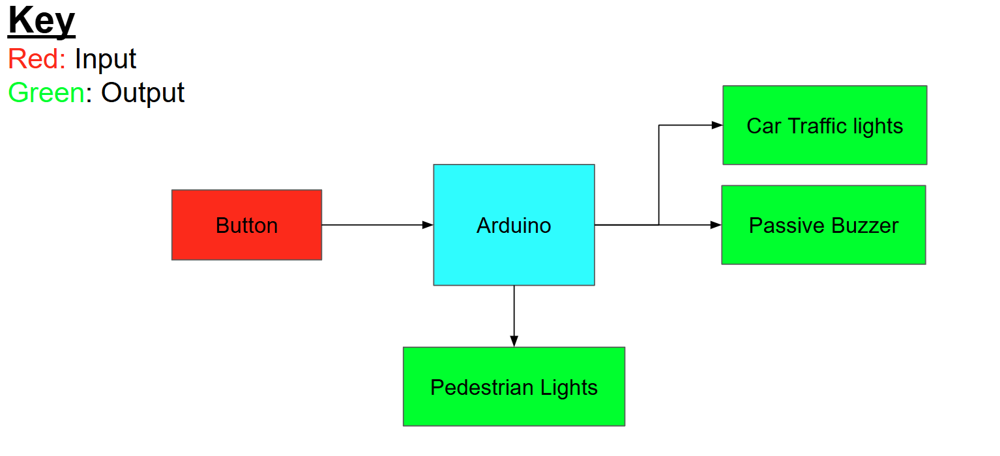
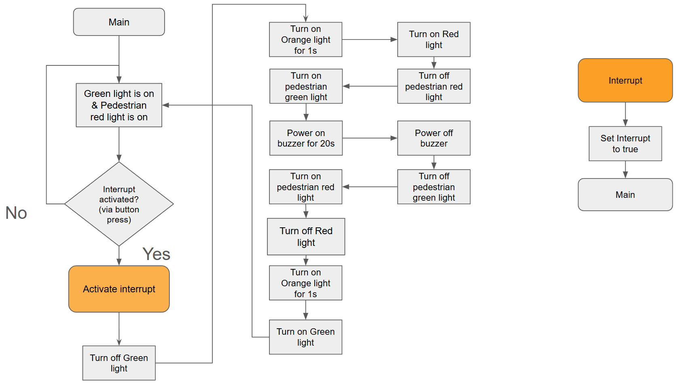
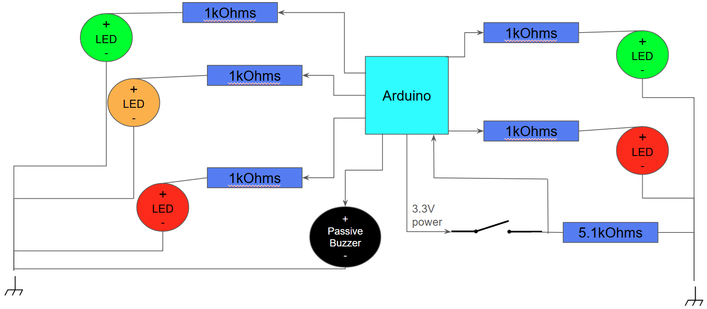

# Arduino-Traffic-Light
A Mini Traffic light system with a basic Arduino set. While not complicated, is a good way to 
learn and start with embedded programming by applying it to something we are all familiar with.
## Components used:
- Arduino Uno
- Red LED (x2)
- Green LED (x2)
- Yellow/Orange LED
- 1kOhm Resistors (x4)
- 5.1kOhm Resistor
- Passive Buzzer

## Block digram representation of the System:

### Arduino
The main controller of the system, it waits for an interrupt activation via the button
which tells it to change state and that the pedestrian's light should be green.

### Car Traffic lights
By default is green then when Arduino detects the button, the lights will go into the sequence:
1. A (1s)
2. R (While buzzer plays sound)
3. RA (1s)
4. G

R = Red
A = Amber
G = Green

When a letter doesn't appear in a specific step of the sequence, that means it's turned off.

### Pedestrian Lights
Similar to the Car Traffic Lights except its just R & G. By default it's pressed, then when 
the buzzer starts making the high frequency noise, G comes on until the buzzer stops it's crossing sound.

### Passive Buzzer
As soon as the traffic light turns red, the Buzzer plays sound similar to that of the Australian/Singaporean
pedestrian sound (https://www.youtube.com/watch?v=C1MMZDY9zZ0, https://www.youtube.com/watch?v=3YhQiC3x31w).

Unlike in real life, if a countdown timer was included, it would require the Arduino to juggle between playing
the sound and counting down on a display screen (since it can't run tasks in parallel like an RPi or FPGA), 
so as of 17th August 2026, this feature has not been added. 

To let the pedestrians know the time is up, a woodpecker sound is added in the end after the main sound just before
the green pedestrian light turns off.

### Button
Once pressed, this will activate an interrupt in the Arduino telling it to stop the default state
(green light and red pedestrian light).

## Flowchart of how the system will operate:
 

This helps visualise how the whole thing will play out on the Arduino as it shows how the Arduino can do it
all sequentially rather than parallel (one of it's limitations).

## Important design consideration:

### Using Interrupts
It is best practice not to use delays inside interrupt functions. Interrupts are meant to be short and inserting a 
delay can cause problems. The point is to allow the Arduino to continue doing what it was before the interrupt. 

A common work around this is to use a (global) boolean variable that tells the main loop what to do when the interrupt occurs.
By default, this boolean variable is false (since there's no interrupt), then when the interrupt is active (by a rising edge),
the interrupt function would change the boolean variable to true. In the main loop, when it sees this variable is now true,
it goes into a branch of code that the Arduino executes outside it's default state (pedestrian light going green in this case).

---
### Resistor values (LEDs)
The current entering the LEDs has been limited with a 1kOhm resistor on each one (connected to the positive terminal of the LED).
The resistor value can't be too high (otherwise insufficient voltage will power the LED) but it also can't be too low to prevent 
burning the LEDs. 1kOhm was arbitrary, you could certainly have used a lower resistor values if you.

---
### Resistor value (push button)
The push button needed to be tied to 0V by default as the interrupt was triggered by a rising edge. A 5kOhm resistor was used which 
similar with the LED's resistor values is also arbitrary.

---

## Simplified diagram of the whole system:

Video demonstration of the system:

[video demo](https://youtube.com/shorts/YJVgU4p8AgM?si=2R3_QEvwthdUSaOR)